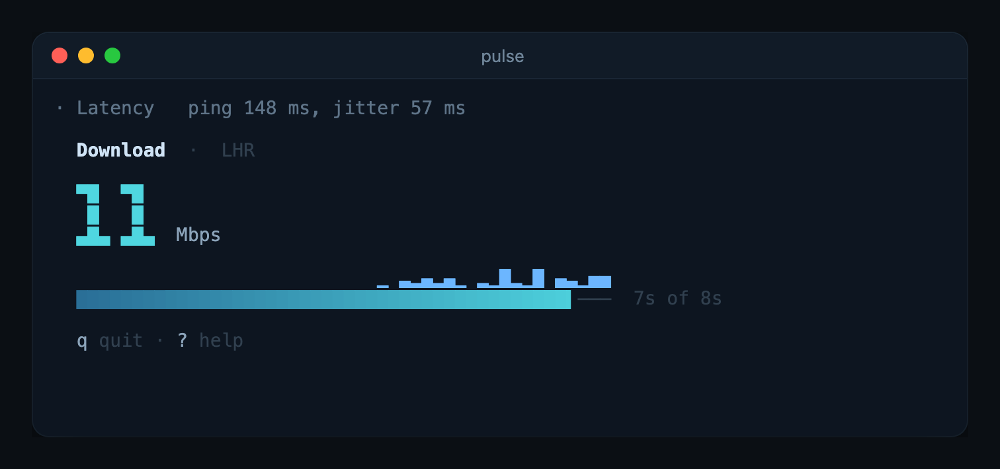

# pulse

Internet speed in your terminal.



pulse checks your ping, download, and upload against Cloudflare's public speed
test. No account, no API key. The live readout stays in a small pane at the
bottom of the terminal, and each result lands in your scrollback when its test
finishes.

## Install

```sh
cargo install --git https://github.com/Zfinix/pulse
```

You need Rust 1.88 or newer. pulse is built on
[kiln](https://github.com/Zfinix/kiln), which Cargo fetches for you.

## Usage

```sh
pulse                   # ping, download, then upload
pulse --no-upload       # skip the upload test
pulse -q                # print only the summary line
pulse --json            # print one JSON object for scripts
pulse --theme nord      # use another colour theme
```

A run ends with one line:

```text
↓ 312 Mbps  ↑ 48 Mbps  ping 12 ms  jitter 3 ms  ·  LHR
```

`LHR` is the Cloudflare data centre that answered. Ping is the median of ten
round trips, and jitter is the average change between one round trip and the
next.

`--json` prints this and nothing else:

```json
{"download_mbps":312.40,"upload_mbps":48.20,"ping_ms":12.00,"jitter_ms":3.40,"colo":"LHR"}
```

A test you skip comes back as `null`. When the output is not a terminal, pulse
skips the live pane and prints the summary line, so `pulse | tee speed.log`
works.

If the network fails, pulse says what happened and what to do next, shows the
raw error under it, and exits with status 1.

## Keys

| Key | Action |
|---|---|
| `q`, `esc`, `ctrl+c` | stop the test and quit |
| `?` | show or hide the key help |

## Configuration

| Flag | Environment | Default |
|---|---|---|
| `--theme <name>` | `PULSE_THEME` | `ocean` |

A flag wins over the environment, and the environment wins over the default.
`pulse --themes` lists every theme.

## How much data a run uses

The download test runs for about 8 seconds and the upload test for about 6.
Requests start at 100 kB and grow toward 25 MB on fast connections. A run
never moves more than about 150 MB down and 50 MB up, and on a typical home
connection it uses far less. Use `--no-download` or `--no-upload` on a metered
connection.

## License

Licensed under the [Apache License, Version 2.0](LICENSE).
